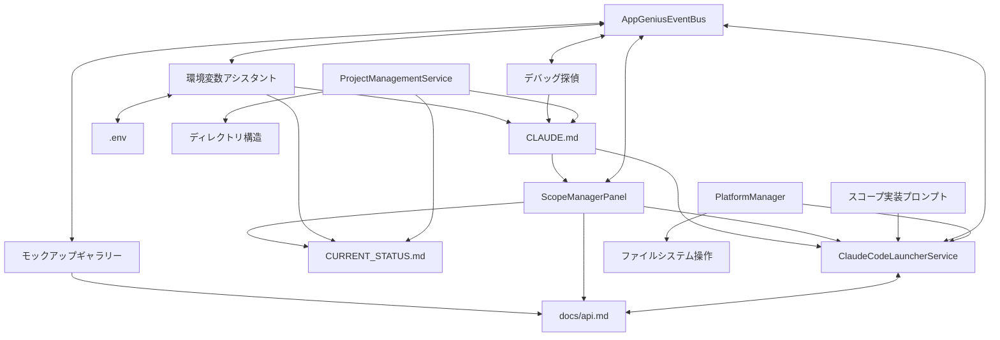

# AppGenius ツールキット管理

このファイルはAppGeniusのツールキット、依存関係、連携の仕組みを管理します。

## ツールキット構成

### コアコンポーネント
- ClaudeCodeLauncherService: ClaudeCodeとの連携
- ScopeManagerPanel: スコープ管理UIとAPI統合管理
- EnvironmentVariablesAssistantPanel: 環境変数管理UI
- DebugDetectivePanel: デバッグ探偵UI
- MockupGalleryPanel: モックアップとAPI抽出UI
- ProjectManagementService: プロジェクト管理サービス
- AppGeniusEventBus: コンポーネント間イベント通信
- PlatformManager: プラットフォーム依存機能の抽象化

### 依存関係図


### 最新バージョン状態
- ClaudeCodeLauncherService: v1.2.0 (2025-03-07)
- ScopeManagerPanel: v1.2.0 (2025-03-07)
- EnvironmentVariablesAssistantPanel: v1.0.2 (2025-03-05)
- DebugDetectivePanel: v1.0.1 (2025-03-04)
- MockupGalleryPanel: v1.1.0 (2025-03-07)
- ProjectManagementService: v1.0.0 (2025-03-07)
- AppGeniusEventBus: v1.1.0 (2025-03-07)
- PlatformManager: v1.0.0 (2025-03-07)

## 連携メカニズム

### ファイル結合方式
```typescript
// 結合ファイル作成方法
const combinedFilePath = path.join(tempDir, `combined_prompt_${Date.now()}.md`);
const combinedContent = promptContent + '\n\n# 追加情報\n\n' + secondContent;
fs.writeFileSync(combinedFilePath, combinedContent, 'utf8');
```

### コマンド起動方式
```typescript
// ClaudeCode起動コマンド
terminal.sendText(`claude ${escapedPromptFilePath}${additionalParams}`);
```

## コンポーネント詳細

### コアサービス

#### ClaudeCodeLauncherService
**役割**: VSCodeからClaudeCodeを起動し、実装スコープに基づいて開発を進めるための連携サービス
**主要機能**:
- `launchClaudeCode`: スコープ情報を基にClaudeCodeを起動
- `launchClaudeCodeWithMockup`: モックアップを解析するためにClaudeCodeを起動
- `launchClaudeCodeWithPrompt`: 指定したプロンプトファイルでClaudeCodeを起動
**依存**: AppGeniusEventBus, PlatformManager, ScopeExporter, MessageBroker
**書き込み権限**: 一時ファイル（combined_prompt_*.md）

#### AppGeniusEventBus
**役割**: コンポーネント間のイベント通信を管理するサービス
**主要機能**:
- `emit`: イベントの発行
- `on`: イベントリスナーの登録
- `off`: イベントリスナーの削除
**依存**: なし
**特徴**: シングルトンパターンによる一元管理

#### PlatformManager
**役割**: プラットフォーム依存機能の抽象化
**主要機能**:
- `getTempDirectory`: 一時ディレクトリの取得
- `getResourceUri`: リソースURIの取得
- `getPathSeparator`: パス区切り文字の取得
**依存**: vscode.Uri, fs, path
**特徴**: クロスプラットフォーム対応

#### ProjectManagementService
**役割**: プロジェクトの作成、読み込み、管理を担当
**主要機能**:
- `createProject`: 新規プロジェクト作成
- `loadProject`: 既存プロジェクト読み込み
- `createInitialDocuments`: テンプレートファイル生成
**依存**: ClaudeMdService, FileOperationManager
**書き込み権限**: プロジェクト全体

### UI パネル

#### ScopeManagerPanel
**役割**: CURRENT_STATUS.mdファイルと連携して実装スコープと環境変数の管理を行うUIパネル
**主要機能**:
- `_loadStatusFile`: CURRENT_STATUS.mdファイルを読み込む
- `_updateStatusFile`: CURRENT_STATUS.mdファイルを更新（環境変数含む）
- `_handleStartImplementation`: 実装開始処理
- `_parseStatusFile`: 環境変数とスコープ関連付け情報の解析
**依存**: FileOperationManager, ClaudeCodeLauncherService, AppGeniusEventBus
**書き込み権限**: CURRENT_STATUS.md, スコープ用一時ファイル

#### EnvironmentVariablesAssistantPanel
**役割**: 環境変数の管理と設定を支援するUIパネル
**主要機能**:
- 環境変数のカテゴリ別管理
- .envと.env.exampleファイルの生成
- CURRENT_STATUS.mdの環境変数セクション更新
**依存**: FileOperationManager, ClaudeCodeLauncherService, AppGeniusEventBus
**書き込み権限**: .env, CURRENT_STATUS.md(環境変数セクションのみ), .claude_ui_data/

#### DebugDetectivePanel
**役割**: エラー検出と解決を支援するUIパネル
**主要機能**:
- エラーセッションの作成と管理
- エラーログの収集と分析
- AIを活用した問題診断と解決策の提案
**依存**: KnowledgeBaseManager, ErrorSessionManager, AppGeniusEventBus
**書き込み権限**: logs/debug/

#### MockupGalleryPanel
**役割**: モックアップの管理とAPI要件抽出を行うUIパネル
**主要機能**:
- モックアップの表示と編集
- モックアップからのAPI抽出
- 要件定義との連携
**依存**: ClaudeCodeLauncherService, FileOperationManager, AppGeniusEventBus
**書き込み権限**: mockups/, docs/scopes/, docs/api.md

## ファイル連携構造

AppGeniusのファイル連携構造は以下の通りです：

### 理想的なディレクトリ構造
```
Root/
├── CLAUDE.md                     # プロジェクト中心情報
├── CURRENT_STATUS.md             # 現在の進捗状況
├── .env                          # 環境変数（.gitignoreに追加）
├── Assistant/                    # AIアシスタントプロンプト
│   ├── requirementsadvicer.md    # 要件定義アドバイザー
│   ├── mockup_analysis_template.md # モックアップ解析テンプレート
│   ├── Scope_Manager_Prompt.md   # スコープ管理プロンプト
│   ├── Scope_Implementation_Assistant_Prompt.md # 実装支援プロンプト
│   ├── DebugDetector.md          # デバッグ探偵プロンプト
│   └── environmentVariablesAssistant-requirements.md # 環境変数要件
├── mockups/                      # モックアップファイル
│   ├── *.html                    # 各ページのモックアップ
│   └── metadata.json             # モックアップ管理情報
├── Requirements/                 # 要件定義
│   ├── requirements.md           # 全体要件定義
│   └── scopes/                   # 個別要件定義
│       ├── *-requirements.md     # 各ページの詳細要件
│       └── *.md                  # その他の要件ドキュメント
├── docs/                         # プロジェクト定義とテンプレート
│   ├── api.md                    # API定義
│   ├── scope.md                  # スコープ定義
│   ├── structure.md              # ディレクトリ構造
│   ├── CLAUDETEMPLATE.md         # CLAUDE.md標準テンプレート
│   └── CURRENT_STATUSTEMPLATE.md # 開発状況標準テンプレート
├── .config/                      # 設定ファイル
│   └── settings.json             # プロジェクト設定
├── logs/                         # ログファイル
│   └── debug/                    # デバッグ情報
│       ├── archived/             # アーカイブされた情報
│       ├── knowledge/            # 知識ベース
│       └── sessions/             # セッション情報
├── reference/                    # 参照情報
└── .claude_ui_data/              # UI連携データ（.gitignoreに追加）
    ├── screenshots/              # UI操作スクリーンショット
    ├── dom_structure.json        # DOM構造データ
    ├── actions.json              # アクション定義
    └── action_results.json       # アクション実行結果
```

### コンポーネントとファイルの対応

#### 要件定義コンポーネント
- 入力: `Assistant/requirementsadvicer.md`
- 出力: 
  - `Requirements/requirements.md`
  - `mockups/` (モックアップファイル)

#### モックアップギャラリー
- 入力:
  - `mockups/*.html`
  - `Assistant/mockup_analysis_template.md`
- 出力:
  - 更新された `mockups/*.html`
  - `Requirements/scopes/*-requirements.md`
  - `docs/api.md`（API定義の初期抽出）

#### スコープマネージャー
- 入力:
  - `Assistant/Scope_Manager_Prompt.md`
  - `Assistant/Scope_Implementation_Assistant_Prompt.md`
  - `docs/structure.md`
  - `docs/api.md`
- 出力/管理:
  - `CURRENT_STATUS.md`
  - `docs/scope.md`
  - `docs/api.md`（API定義の統合・更新）
  - `.env` (環境変数アシスタントと連携)

#### デバッグ探偵
- 入力:
  - `Assistant/DebugDetector.md`
- 出力/管理:
  - `logs/debug/knowledge/` (知識ベース)
  - `logs/debug/sessions/` (セッション情報)
  - `logs/debug/archived/` (アーカイブ)

#### 環境変数アシスタント
- 入力:
  - `Assistant/environmentVariablesAssistant-requirements.md`
  - `CURRENT_STATUS.md`（現在の設定状況）
- 出力/管理:
  - `.env`（実際の環境変数値）
  - `CURRENT_STATUS.md`の環境変数セクション更新

## 各コンポーネントの役割と生成物

### 要件定義
- **入力**: ユーザーの要求、既存プロジェクト情報
- **処理**: requirementsadvicer.mdの指示に基づきAIが要件を整理
- **出力**: requirements.md、初期モックアップHTML
- **書き込み責任**: requirements.mdの全体構造、シンプルなモックアップファイル

### モックアップギャラリー
- **入力**: モックアップHTMLファイル、ユーザーフィードバック
- **処理**: mockup_analysis_template.mdの指示に基づきAIがUIを分析・改善・API要件抽出
- **出力**: 改善されたモックアップHTML、個別要件定義ファイル、API定義初期データ
- **書き込み責任**: モックアップファイルの更新、*-requirements.mdファイルの生成、api.mdの初期抽出

### スコープマネージャー
- **入力**: scope.md、structure.md、CURRENT_STATUS.md、api.md、各ページ要件定義
- **処理**: Scope_Manager_Prompt.mdの指示に基づきAIがスコープと環境変数を定義・管理・API統合
- **出力**: 
  - 更新されたCURRENT_STATUS.md（環境変数セクションとスコープ別環境変数を含む）
  - scope.md（機能中心のスコープ定義）
  - api.md（API定義の統合）
- **書き込み責任**: 
  - CURRENT_STATUS.mdの進捗更新とスコープ別環境変数セクション管理
  - scope.mdのスコープ定義（実装対象機能を中心に）
  - api.mdの一元管理と整合性確保

### デバッグ探偵
- **入力**: エラーログ、コードスニペット
- **処理**: DebugDetector.mdの指示に基づきAIがエラーを分析
- **出力**: エラー解決策、セッション記録
- **書き込み責任**: logs/debug/内のセッションファイル、knowledge base

### 環境変数管理フロー
- **初期検出** (モックアップ分析 - mockup_analysis_template.md)
  - **入力**: モックアップ、ユーザーとの対話
  - **処理**: 要件定義から必要な環境変数を特定と説明付き定義
  - **出力**: 要件ドキュメントの「API・バックエンド連携」セクションに分かりやすい説明付き環境変数リスト

- **一元集約とスコープ関連付け** (スコープマネージャー - Scope_Manager_Prompt.md)
  - **入力**: 各要件ドキュメントから環境変数情報と説明を収集
  - **処理**: スコープと環境変数の関連付け、CURRENT_STATUS.mdに初期化
  - **出力**: CURRENT_STATUS.mdの環境変数セクションとスコープ別環境変数セクション（すべて未設定状態）

- **使用確認と進捗率連動** (スコープ実装アシスタント - Scope_Implementation_Assistant_Prompt.md)
  - **入力**: コード実装過程での環境変数使用、スコープ進捗情報
  - **処理**: 使用確認、ダミー値使用の記録、スコープ進捗率への反映
  - **出力**: 
    - CURRENT_STATUS.mdの環境変数に [!] マーク（使用確認済み）追加
    - スコープ進捗率の計算に環境変数設定状況を反映（未設定の環境変数がある場合は90%上限）

- **エラー検出と修正推奨** (デバッグ探偵 - DebugDetector.md)
  - **入力**: エラーログ、関連コード
  - **処理**: 環境変数関連エラーの検出と分析
  - **出力**: 環境変数設定変更の推奨

- **実値設定と完了連動** (環境変数アシスタント - EnvironmentVariablesAssistantPanel)
  - **入力**: CURRENT_STATUS.mdの環境変数状態とスコープ別環境変数情報、プロジェクトコード
  - **処理**: 実際の環境変数値の設定と検証、スコープ完了状態との連携
  - **出力**: 
    - .envファイル（実際の値）
    - CURRENT_STATUS.mdの設定完了更新（[x] マーク）
    - スコープの進捗率100%化（スコープに必要な全環境変数が設定済みの場合）

## テンプレート管理システム

AppGeniusは、プロジェクト初期化時に使用する標準テンプレートファイルを整備し、一貫した開発体験を提供します。

### 標準テンプレートファイル

以下の標準テンプレートファイルを`docs/`ディレクトリに配置しています：

1. **CLAUDETEMPLATE.md**
   - 目的: プロジェクト全体の情報を一元管理するCLAUDE.mdの構造を定義
   - 主要セクション:
     - プロジェクト概要
     - 技術スタック
     - 開発ワークフロー
     - 開発アシスタント説明
     - プロジェクト構造
     - 環境変数管理
   - 特徴: ClaudeCodeとの連携を意識した構造化、全アシスタントとの連携ポイント明示

2. **CURRENT_STATUSTEMPLATE.md**
   - 目的: 開発状況と進捗管理のための構造を定義
   - 主要セクション:
     - 全体進捗
     - スコープ状況（完了/進行中/未着手）
     - ディレクトリ構造
     - 実装ファイル状況
     - 引継ぎ情報
     - 環境変数設定状況
   - 特徴: スコープマネージャーUIと環境変数アシスタントUIに最適化された構造

### テンプレート適用プロセス

ProjectManagementServiceは、新規プロジェクト作成時に以下のプロセスでテンプレートを適用します：

1. `createProject()`メソッドでプロジェクトフォルダを作成
2. テンプレートをコピーし、プロジェクト固有の情報で置換
3. 標準ディレクトリ構造を作成
4. 初期ファイルを生成

```typescript
// ProjectManagementService.ts の実装例
public async createProject(projectName: string, location: string): Promise<string> {
  // プロジェクトディレクトリ作成
  const projectPath = path.join(location, projectName);
  fs.mkdirSync(projectPath, { recursive: true });
  
  // テンプレートファイルのコピーと置換
  await this._copyAndReplaceTemplate(
    'CLAUDETEMPLATE.md', 
    path.join(projectPath, 'CLAUDE.md'),
    { projectName, date: new Date().toISOString().split('T')[0] }
  );
  
  // ディレクトリ構造の作成
  this._createStandardDirectoryStructure(projectPath);
  
  // 残りのファイル生成...
  return projectPath;
}
```

## 既知の課題と対策

1. **ファイル整理の一貫性**
   - 課題: 現在のファイル構造が最適化されていない
   - 対策: 理想的なディレクトリ構造へ段階的に移行
   - 進捗: Assistant/ ディレクトリへのプロンプト移動を開始
   - ✅ テンプレートファイルを整備し標準構造を定義 (2025-03-07)

2. **命名規則の標準化**
   - 課題: ファイル名の命名規則にばらつきがある
   - 対策: 統一的な命名規則の策定と適用
   - 進捗: コンポーネント名はPascalCase、ファイル名はcamelCaseに統一中

3. **CLAUDE.md初期テンプレートの改善**
   - 課題: 初期テンプレートが十分に構造化されていない
   - 対策: より体系的なテンプレートの作成
   - 進捗: 環境変数、コンポーネント連携セクションを追加
   - ✅ CLAUDETEMPLATE.mdを作成・整備 (2025-03-07)

4. **CURRENT_STATUS.md初期テンプレートの標準化**
   - 課題: 初期状態が定義されていない
   - 対策: 標準テンプレートの作成と適用
   - 進捗: スコープ状況、進捗率、環境変数セクションのテンプレート化
   - ✅ CURRENT_STATUSTEMPLATE.mdを作成・整備 (2025-03-07)

5. **環境変数管理の簡素化と一元化**
   - 課題: `.env.example`ファイルは不要と判断、CLAUDE.mdとの二重管理も非効率
   - 対策: 環境変数の状態管理をCURRENT_STATUS.mdに一元化し、.envファイルと連携
   - 進捗: CURRENT_STATUS.md内の環境変数セクションを標準化
   - ✅ 環境変数の状態表記ルールを確立（[ ]/[!]/[x]） (2025-03-07)

6. **コンポーネント間通信の強化**
   - 課題: コンポーネント間の連携が直接的で結合度が高い
   - 対策: AppGeniusEventBusを中心とした疎結合アーキテクチャへの移行
   - 進捗: 主要コンポーネントへのEventBus統合を完了

7. **クロスプラットフォーム対応の強化**
   - 課題: プラットフォーム依存コードが散在している
   - 対策: PlatformManagerを通じた抽象化と統一インターフェースの提供
   - 進捗: ファイルシステム操作、パス管理のPlatformManager移行を実施中

## 環境変数ステータスの表記ルール

CURRENT_STATUS.mdにおける環境変数の状態は、以下の表記ルールで管理されます：

```markdown
## 環境変数設定状況

- [ ] DB_HOST - データベースに接続するための名前やアドレス
- [!] API_KEY - 外部サービスへのアクセスキー（使用確認済み、仮の値で実装中）
- [x] PORT - アプリケーションが使用するポート番号（設定完了）

### スコープ別必要環境変数

#### スコープ1: 初期セットアップ
必要な環境変数:
- [ ] NODE_ENV - アプリケーションの動作モード（開発・本番）
- [x] PORT - アプリケーションが使用するポート番号

#### スコープ2: ユーザー認証
必要な環境変数:
- [!] JWT_SECRET - ユーザー認証に使う暗号化キー（使用確認済み）
- [ ] SESSION_SECRET - セッション管理に使う暗号化キー
```

状態の意味:
- `[ ]` - 未設定状態（初期状態）
- `[!]` - 使用確認済み・設定要（実装アシスタントが更新）
- `[x]` - 設定完了・検証済み（環境変数アシスタントが更新）

### 環境変数ステータス遷移

1. **初期状態** `[ ]` 
   - スコープマネージャーが要件定義から収集し初期化
   - スコープごとに必要な環境変数として関連付け
   - 設定が必要だが、まだ使用確認されていない状態

2. **使用確認済み** `[!]`
   - スコープ実装アシスタントが実装時に使用を確認
   - ダミー値で実装されているケースが多い
   - スコープの進捗率に影響（環境変数設定も進捗に反映）
   - 早急に実際の値設定が必要な状態

3. **設定完了** `[x]`
   - 環境変数アシスタントで実際の値を設定・検証済み
   - 関連するスコープの進捗率が100%に到達可能に
   - 本番環境でも動作する状態

## アップグレード計画

以下のスケジュールでAppGeniusツールキットの改善を進めます：

### 短期改善計画 (2025-Q2)
1. ✅ 標準テンプレートの作成と整備 (2025-03-07)
   - CLAUDETEMPLATE.md
   - CURRENT_STATUSTEMPLATE.md
2. 理想的なディレクトリ構造への移行
   - Assistant/ ディレクトリの標準化
   - Requirements/ ディレクトリの整備
   - .config/ ディレクトリの導入
3. 命名規則の標準化とドキュメント化
   - コンポーネント名: PascalCase
   - ファイル名: camelCase
   - プロンプトファイル: スネークケース_Prompt.md
4. テンプレート適用メカニズムの実装
   - ProjectManagementService.tsの機能強化
   - テンプレート置換機能の実装
5. API管理体制の確立
   - モックアップギャラリーでの抽出
   - スコープマネージャーでの統合
6. 環境変数管理フローの完全実装
   - 5段階の役割分担による管理
   - 状態表記の統一運用

### 中期改善計画 (2025-Q3)
1. UI連携機能の強化
   - .claude_ui_data/フォーマットの標準化
   - リアルタイムUI監視メカニズムの改善
2. イベント駆動アーキテクチャの完全適用
   - AppGeniusEventBusによる連携の完全実装
   - イベントタイプの標準化と文書化
3. デバッグ知識ベースの拡充
   - 共通問題と解決策の蓄積
   - AIによる自動解決フローの改善
4. スコープマネージャーUIの改善
   - ファイル中心から機能中心へ（実装済み）
   - 視覚的進捗表示の強化

### 長期改善計画 (2025-Q4)
1. プロジェクト間でのツールキット共有機能
   - 共有テンプレートライブラリ
   - 設定の移行・継承機能
2. AIプロンプト自動最適化システム
   - 学習によるプロンプト改善
   - プロジェクトタイプ別の特化型プロンプト
3. マルチプラットフォーム対応の強化
   - Windows/Mac/Linuxでの完全互換性
   - PlatformManagerの高度抽象化
4. リファレンス管理システムの強化
   - 知識ベースの構造化
   - AIによる自動参照と推奨

## リファクタリング優先順位

以下の観点からリファクタリングの優先順位を設定します：

### 直ちに対応すべき課題 (優先度: 最高)
1. **ファイルパス管理の一元化**
   - PlatformManagerへのパス関連機能の統合
   - 相対パスの絶対パスへの変換徹底
   - プロジェクトパス引数の標準化

2. **イベント駆動アーキテクチャへの移行**
   - AppGeniusEventBus経由の通信徹底
   - 直接的依存関係の減少
   - イベントタイプの統一と文書化

3. **コンポーネント間の責任分担明確化**
   - ファイル書き込み権限の明確化
   - 状態管理の一元化
   - 重複機能の統合

### 改善すべき課題 (優先度: 高)
1. **ディレクトリ構造の整理**
   - プロンプトファイルのAssistant/ディレクトリへの移動
   - docs/ディレクトリの整理（Requirements/への分離）
   - .claude_ui_dataディレクトリの標準化

2. **テンプレート管理の強化**
   - ✅ CLAUDE.md標準テンプレートの改善 (2025-03-07)
   - ✅ CURRENT_STATUS.md標準テンプレートの適用 (2025-03-07)
   - プロジェクト初期化テンプレートの改善

3. **環境変数管理フローの最適化**
   - スコープと環境変数の関連付け強化
   - 環境変数状態管理の視覚化
   - セキュリティ考慮の強化

### 長期改善計画 (優先度: 中)
1. **完全モジュール化アーキテクチャ**
   - 各コンポーネントの完全な疎結合化
   - プラグイン形式の拡張機能サポート
   - 共通インターフェースの策定

2. **複数プロジェクトサポート**
   - プロジェクト間でのコンポーネント共有
   - 中央リポジトリからのテンプレート取得
   - ユーザー設定の持ち越し

3. **AI処理の最適化**
   - プロンプトテンプレートの自動最適化
   - ClaudeCode呼び出しの効率化
   - 結果キャッシュとインクリメンタル更新

## 実施スケジュール

### 短期改善計画 (2025-Q2)
1. ファイルパス管理一元化 (4月)
2. イベント駆動アーキテクチャへの移行 (4月-5月)
3. ディレクトリ構造の整理 (5月)
4. コンポーネント間責任分担明確化 (5月-6月)
5. テンプレート管理の強化 (6月)

### 中期改善計画 (2025-Q3)
1. 環境変数管理フローの最適化 (7月)
2. API管理体制の確立 (7月-8月)
3. デバッグ知識ベースの拡充 (8月)
4. 完全モジュール化アーキテクチャ開始 (9月)

### 長期改善計画 (2025-Q4)
1. 複数プロジェクトサポート (10月-11月)
2. AI処理の最適化 (11月)
3. リファレンス管理システムの強化 (12月)
4. 共有リポジトリとプラグイン対応 (12月)